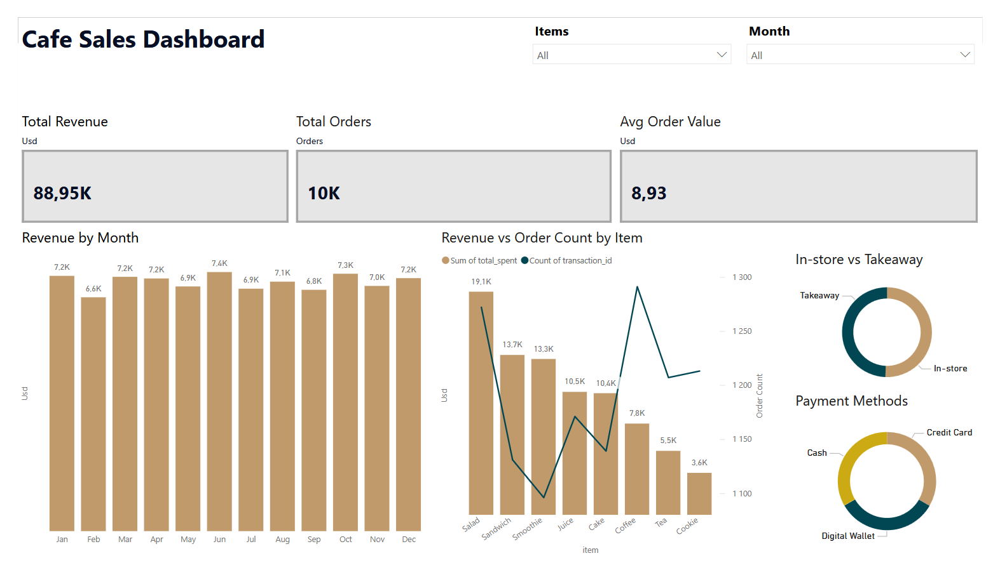

# Cafe Sales Analysis
 
Data cleaning, SQL analysis and Power BI dashboard for a cafe sales dataset with 10,000 transactions.
 
## Dashboard

 
## Problem
A cafe wants to understand what drives revenue, whether location or seasonality matters, and where to focus efforts to grow sales.
 
## Key Insights
 
- **Salad** generates the most revenue ($19,070) despite being 2nd in order volume — because it costs $5.00 vs Coffee at $2.00
- **Coffee** leads in order count (1,285) but ranks 6th in revenue ($7,800) — it drives traffic, not revenue
- Location does not matter — In-store ($9.03) and Takeaway ($8.80) average order values are nearly identical
- No seasonality — revenue is stable year-round, difference between best and worst month is only $716
- **June** is the strongest month by revenue per day ($245), **July** is the weakest ($221)
- All three payment methods are equally popular — Digital Wallet, Credit Card and Cash each account for ~33%
- 30% of payment data and significant location data is missing — limits confidence in some findings
## Recommendations
 
1. **Promote Salad** — highest revenue per order, already popular, clear upsell opportunity
2. **Investigate July slowdown** — weakest month with no obvious seasonal reason
3. **Keep all payment options** — no dominant method, removing any would hurt customers
4. **Improve data collection** — 30% missing payment data reduces analytical confidence
## Data Cleaning
Raw dataset had multiple quality issues handled in Python:
- `ERROR` and `UNKNOWN` values replaced with NaN
- Column types fixed (numeric, date)
- `Total Spent` recovered from `Quantity × Price Per Unit` (173 → 40 nulls remaining)
- `Quantity` and `Price Per Unit` recovered where possible
- `Item` partially recovered via price-to-item mapping
## Tools
Python (pandas) · PostgreSQL · Power BI
